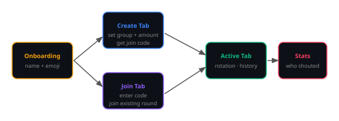

# Shout 🍺

> Track who's shouting — create or join a tab for a round, see the rotation, and settle up fairly.

<p align="center">
  
  
  
</p>

---

Shout is an Australian term for buying a round of drinks for your group. This app tracks the rotation fairly — who's bought a round, who's up next, and the full history. Create a tab, share the code, and everyone joins on their phone.

---

## App Flow

<p align="center">
  
</p>

---

## Features

- **Create a tab** — start a new round, set your group, share a join code
- **Join a tab** — enter a code to jump into an existing round
- **Rotation tracking** — see exactly who's up next based on history
- **Tab history** — full log of every round per tab
- **Stats** — who's shouted the most, who owes one
- **Profile** — display name + avatar emoji, persisted across sessions
- **Onboarding** — quick first-run setup, one screen

---

## Tech Stack

| Layer | Technology |
|---|---|
| Framework | Expo (React Native) |
| Router | Expo Router (file-based) |
| Auth | Firebase Auth |
| Database | Firebase Firestore |
| State | Custom hooks (`useAuth`, `useTab`) |
| Location | expo-location |
| Language | TypeScript |

---

## Project Structure

```
app/
  index.tsx              # Entry — routes to onboarding or tabs
  onboarding.tsx         # First-run name + emoji setup
  create-tab.tsx         # Create a new tab
  join.tsx               # Join by code
  (tabs)/
    index.tsx            # Home — your active tabs list
    profile.tsx          # Profile + settings
  tab/[id]/
    index.tsx            # Active tab — rotation + current round
    history.tsx          # Full round history
    stats.tsx            # Shout stats per member
components/
  TabCard.tsx            # Tab summary tile
hooks/
  useAuth.ts             # Firebase auth + profile state
  useTab.ts              # Tab + round Firestore listeners
lib/
  firebase.ts            # Firebase init (via env vars)
```

---

## Getting Started

```bash
npm install
cp .env.example .env    # fill in Firebase config
npx expo start          # Expo Go / simulator
npx expo start --ios
npx expo start --android
```

**Required env vars** — see `.env.example`:
```
EXPO_PUBLIC_FIREBASE_API_KEY
EXPO_PUBLIC_FIREBASE_AUTH_DOMAIN
EXPO_PUBLIC_FIREBASE_PROJECT_ID
EXPO_PUBLIC_FIREBASE_STORAGE_BUCKET
EXPO_PUBLIC_FIREBASE_MESSAGING_SENDER_ID
EXPO_PUBLIC_FIREBASE_APP_ID
```
